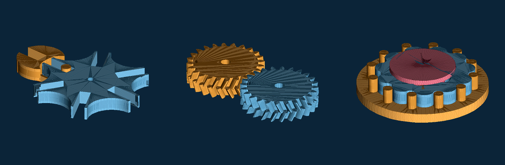
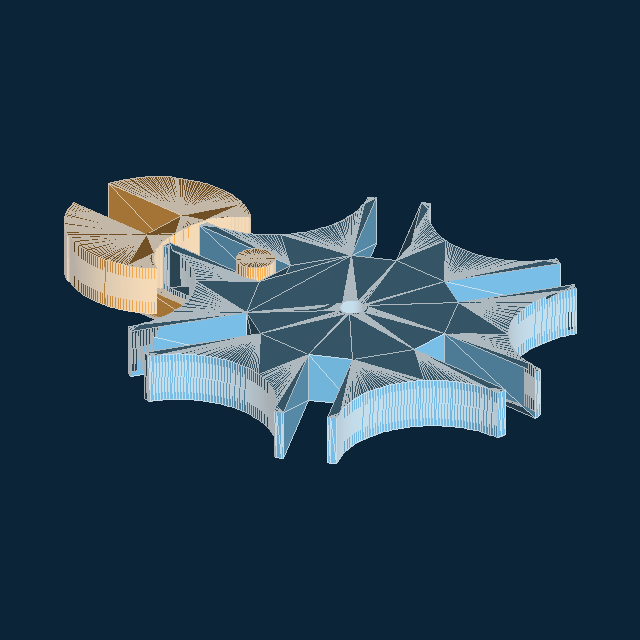
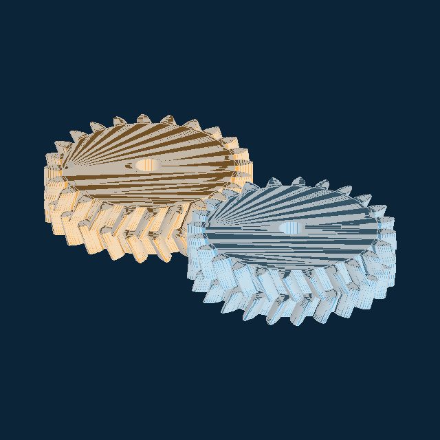
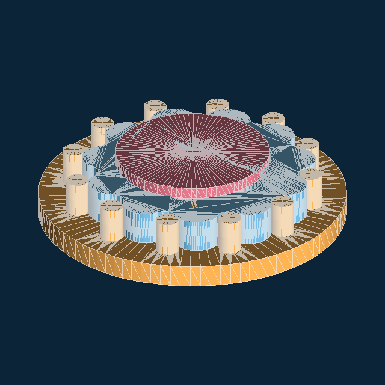

# mechlib

Parametric, FDM-printable mechanical parts for Python
([trimesh](https://trimesh.org) · shapely · manifold3d).

### [Open the interactive gallery →](https://m-esm.github.io/mechlib/)

[](https://m-esm.github.io/mechlib/)

<p align="center">
  <a href="https://m-esm.github.io/mechlib/"></a>
  <a href="https://m-esm.github.io/mechlib/"></a>
  <a href="https://m-esm.github.io/mechlib/"></a>
</p>

Spin 140+ components in 3D, play mechanism animations, and retune any part live
in the browser. The gallery is the docs: search, categories, and a parameter
playground that runs mechlib itself via Pyodide.

## Install

```bash
pip install git+https://github.com/m-esm/mechlib
```

```python
import mechlib as ml

body = ml.rbox((40, 24, 12), r=3)
body = ml.sub(body, ml.teardrop(4.1, 50, axis="x", up=(0, 0, 1)))
ml.export_stl(body, "bracket.stl")
```

Semi-primitive building blocks only (gears, cams, linkages, ratchets,
couplings, flexures, cutters, fasteners). Explicit arguments, no project
config. MIT licensed.

**For AI agents / part selection:** each API has a real-machinery use case in
[`mechlib/usecases.py`](mechlib/usecases.py) (`search_use_cases("robot joint")`,
`use_case("four_bar")`). Same text appears as **Used in** on every gallery
card. See [`AGENTS.md`](AGENTS.md).

**[m-esm.github.io/mechlib](https://m-esm.github.io/mechlib/)**
